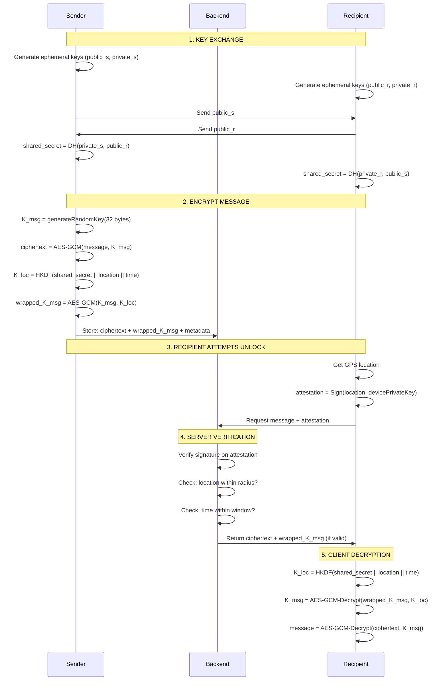

# LOCATION-BOUND MESSAGING SYSTEM - SPECIFICATION

**Version:** 1.0.0  
**Status:** Demo / Educational Implementation  
**Author:** OpenCode  
**Date:** 2025-11-05

---

## Table of Contents

1. [Overview](#overview)
2. [60-Second Explanation](#60-second-explanation)
3. [Architecture](#architecture)
4. [Cryptography Explained](#cryptography-explained)
5. [Location-Bound Encryption Flow](#location-bound-encryption-flow)
6. [Location Attestation & Anti-Spoofing](#location-attestation--anti-spoofing)
7. [LAN/Offline Operation](#lanoffline-operation)
8. [API Specification](#api-specification)
9. [UI/UX Design](#uiux-design)
10. [Security Considerations](#security-considerations)
11. [Running the Demo](#running-the-demo)
12. [MVP Checklist](#mvp-checklist)

---

## Overview

**Purpose:** Create a secure messaging system where messages can only be decrypted when the recipient is physically present at a specific GPS location.

**Key Features:**
- Messages encrypted to specific coordinates (latitude, longitude, radius)
- Time-bound decryption windows
- Works on local networks (LAN/offline capable)
- Simple, teachable cryptography
- Terminal-style cyber UI (green-on-black hacker aesthetic)

**Use Cases:**
- Dead drops / geocaching with encryption
- Location-based secrets for events/games
- Emergency message systems
- Educational demonstration of location-bound cryptography

---

## 60-Second Explanation

**How Location-Bound Encryption Works:**

1. **Key Exchange:** Sender and recipient perform Diffie-Hellman (X25519) to establish a shared secret
   - Neither party sends the shared secret over the network
   - Both compute it independently from their private key + peer's public key

2. **Location Binding:** Sender derives a special key using HKDF (key derivation function):
   ```
   K_loc = HKDF(shared_secret || lat || lon || radius || time_window)
   ```
   - The coordinates become part of the key material
   - Different location = different key

3. **Double Encryption:**
   - Message encrypted with random key `K_msg` using AES-GCM
   - `K_msg` is then wrapped (encrypted) with `K_loc`

4. **Unlocking:** Recipient must:
   - Be at the correct GPS coordinates
   - Have the correct time window
   - Compute the same `K_loc` using their copy of the shared secret + location
   - Unwrap `K_msg` and decrypt the message

**The Magic:** Wrong location → wrong `K_loc` → cannot unwrap `K_msg` → cannot decrypt message.

---

## Architecture

### System Components

```
┌─────────────────┐         ┌──────────────────┐         ┌─────────────────┐
│   Frontend      │◄───────►│    Backend       │◄───────►│   Frontend      │
│   (Sender)      │  HTTPS  │  (Relay/Store)   │  HTTPS  │  (Recipient)    │
│                 │         │                  │         │                 │
│  React SPA      │  WS     │ Node.js/Express  │  WS     │  React SPA      │
│  Terminal UI    │◄───────►│  WebSocket       │◄───────►│  Terminal UI    │
│  Crypto (Web)   │         │  mDNS Discovery  │         │  Crypto (Web)   │
└─────────────────┘         └──────────────────┘         └─────────────────┘
       │                                                          │
       │                    P2P Option (WebRTC)                  │
       └─────────────────────────────────────────────────────────┘
```

### Technology Stack

**Frontend:**
- React 18 + TypeScript
- Vite (build tool)
- TailwindCSS (terminal theme)
- Leaflet (maps)
- TweetNaCl (crypto primitives)
- Web Crypto API (HKDF, AES-GCM)

**Backend:**
- Node.js 18+ with Express
- WebSocket (ws library)
- TweetNaCl (crypto primitives)
- mDNS (multicast-dns for LAN discovery)

**Protocol:**
- HTTP/REST for message storage
- WebSocket for P2P signaling
- WebRTC DataChannels (optional P2P)

---

## Cryptography Explained

All cryptographic primitives explained in one sentence each:

### 1. X25519 (Elliptic-Curve Diffie-Hellman)

**What:** Two parties generate a shared secret without sending it over the network.

**How it works:**
```
Alice:  private_a, public_a = generateKeyPair()
Bob:    private_b, public_b = generateKeyPair()

[Alice sends public_a to Bob]
[Bob sends public_b to Alice]

shared_secret_alice = DH(private_a, public_b)  // Alice computes
shared_secret_bob   = DH(private_b, public_a)  // Bob computes

shared_secret_alice == shared_secret_bob  // Same value!
```

**Why we use it:** Establish end-to-end encryption without pre-shared keys.

### 2. AES-GCM (Advanced Encryption Standard - Galois/Counter Mode)

**What:** Symmetric authenticated encryption - encrypts data and prevents tampering.

**How it works:**
```
ciphertext, authTag = AES-GCM-Encrypt(plaintext, key, nonce)
plaintext = AES-GCM-Decrypt(ciphertext, key, nonce, authTag)
```

**Why we use it:** Fast, secure encryption with built-in integrity checking.

**Critical rule:** NEVER reuse nonce with the same key!

### 3. HKDF (HMAC-based Key Derivation Function)

**What:** Derives cryptographic keys from input material (like passwords or shared secrets).

**How it works:**
```
key = HKDF(inputKeyMaterial, salt, contextInfo, outputLength)
```

**Why we use it:** Transform shared secret + location into a location-specific key.

**Our usage:**
```typescript
K_loc = HKDF(
  sharedSecret,                           // Input key material
  "LocationBoundMessaging-v1",            // Salt (fixed)
  JSON.stringify({lat, lon, radius, ...}), // Context (location binding)
  32                                      // Output: 256-bit key
)
```

### 4. HMAC-SHA256 (Hash-based Message Authentication Code)

**What:** Proves message integrity and authenticity using a secret key.

**How it works:**
```
mac = HMAC-SHA256(message, key)
isValid = verify(message, mac, key)
```

**Why we use it:** Sign attestations and verify data hasn't been tampered with.

### 5. Ed25519 (Edwards-curve Digital Signatures)

**What:** Digital signatures for proving who created a message.

**How it works:**
```
signature = Ed25519-Sign(message, privateKey)
isValid = Ed25519-Verify(message, signature, publicKey)
```

**Why we use it:** Device signs GPS attestations to prove location reading came from legitimate device.

---

## Location-Bound Encryption Flow

### Complete Message Send/Receive Flow



### Detailed Steps

**STEP 1: Sender Composes Message**

```typescript
// Generate ephemeral sender keys
const senderKeys = generateX25519KeyPair();

// Compute shared secret with recipient's public key
const sharedSecret = computeSharedSecret(
  senderKeys.privateKey,
  recipientPublicKey
);

// Generate random message encryption key
const K_msg = generateAesKey(); // 32 random bytes

// Encrypt message with K_msg
const { ciphertext, nonce, authTag } = await aesGcmEncrypt(message, K_msg);
```

**STEP 2: Derive Location-Bound Key**

```typescript
// Derive key bound to location + time
const K_loc = await deriveLocationBoundKey(
  sharedSecret,
  latitude,
  longitude,
  radiusMeters,
  windowStart,    // Unix timestamp
  windowEnd,      // Unix timestamp
  nonce           // Random nonce for uniqueness
);
```

**STEP 3: Wrap Message Key**

```typescript
// Encrypt K_msg with K_loc
const { wrappedKey, nonce: wrapNonce, authTag: wrapTag } = 
  await wrapKey(K_msg, K_loc);

// Store on server: ciphertext + wrapped key (NOT K_msg or K_loc!)
```

**STEP 4: Recipient Unlocks**

```typescript
// Recipient at location computes shared secret
const sharedSecret = computeSharedSecret(
  recipientPrivateKey,
  senderPublicKey
);

// Derive same K_loc (ONLY works if at correct location!)
const K_loc = await deriveLocationBoundKey(
  sharedSecret,
  latitude,      // Must match sender's location
  longitude,
  radiusMeters,
  windowStart,
  windowEnd,
  nonce          // From message metadata
);

// Unwrap K_msg
const K_msg = await unwrapKey(wrappedKey, K_loc, wrapNonce, wrapTag);

// Decrypt message
const plaintext = await aesGcmDecrypt(ciphertext, K_msg, nonce, authTag);
```

---

## Location Attestation & Anti-Spoofing

### Creating Location Attestation

```typescript
interface LocationAttestation {
  deviceId: string;
  devicePublicKey: string;
  latitude: number;
  longitude: number;
  accuracy: number;
  timestamp: number;
  
  // Anti-spoofing context
  wifiSSIDs?: string[];
  cellTowers?: CellTowerInfo[];
  movementHistory?: LocationPoint[];
  
  // Signature
  signature: string;  // Ed25519 signature
}
```

**Creating attestation:**
```typescript
const attestation = createLocationAttestation(
  deviceId,
  devicePrivateKey,
  devicePublicKey,
  currentLat,
  currentLon,
  gpsAccuracy
);
```

### Anti-Spoofing Checks

**1. Signature Verification**
- Verify Ed25519 signature on attestation
- Ensures attestation hasn't been tampered with

**2. Timestamp Freshness**
- Check attestation is recent (< 5 minutes old)
- Prevents replay attacks

**3. Geofence Check**
- Calculate distance using Haversine formula:
```typescript
function calculateDistance(lat1, lon1, lat2, lon2) {
  const R = 6371000; // Earth radius in meters
  // ... haversine calculation
  return distance;
}

const { distance, within } = isWithinGeofence(
  currentLat, currentLon,
  targetLat, targetLon,
  radiusMeters
);
```

**4. Impossible Movement Detection**
- Check movement history for physically impossible speeds
- Flag if speed > 200 m/s (faster than aircraft)

**5. Continuous Presence (Optional)**
- Require device to show multiple readings over time
- Prevents "drive-by" unlocks

**6. Additional Context (Future)**
- WiFi SSID matching
- Cell tower triangulation
- Hardware attestation (TPM/Secure Enclave)

### Limitations & Warnings

**⚠️ GPS Spoofing is Possible**

Consumer GPS can be spoofed with ~$200 hardware. For high-security applications:

- Use additional sensors (WiFi, cellular, accelerometer)
- Require hardware attestation (TPM, Android SafetyNet, iOS DeviceCheck)
- Implement continuous presence checks
- Add behavioral analysis (movement patterns)

**This is an educational demo - not production-grade security!**

---

## LAN/Offline Operation

### Network Discovery (mDNS)

Backend advertises itself on LAN using multicast DNS:

```typescript
// Server advertises service
mdns.respond({
  name: 'locmsg.http.local',
  type: 'A',
  data: '192.168.1.100',
  ttl: 300
});

// Clients discover server
const servers = await discoverServers('locmsg.http.local');
```

### WebSocket Signaling

For P2P WebRTC connections, backend acts as signaling server:

```typescript
// Client A sends offer
ws.send({
  type: 'offer',
  from: 'clientA',
  to: 'clientB',
  data: sdpOffer
});

// Server forwards to Client B
// Client B responds with answer
```

### Offline/Air-Gapped Mode

For complete air-gap scenarios:

**Option 1: Pre-shared keys on USB**
- Generate ephemeral keys offline
- Exchange public keys via USB stick
- Encrypt message offline
- Transfer ciphertext via USB

**Option 2: QR Code Exchange**
- Display public key as QR code
- Scan with receiving device
- Works without any network

**Option 3: Threshold Decryption**
- Split location-bound key among N nearby devices
- Require M-of-N devices to reconstruct key
- Ensures multiple parties confirm location

---

## API Specification

### REST Endpoints

#### POST /api/messages
Store encrypted message

**Request:**
```json
{
  "id": "msg-abc123",
  "senderPublicKey": "base64...",
  "recipientPublicKey": "base64...",
  "encryptedPayload": "base64...",
  "payloadNonce": "base64...",
  "payloadAuthTag": "base64...",
  "wrappedKey": "base64...",
  "wrappedKeyNonce": "base64...",
  "wrappedKeyAuthTag": "base64...",
  "locationBinding": {
    "latitude": 18.5204,
    "longitude": 73.8567,
    "radiusMeters": 100,
    "windowStart": 1699564800000,
    "windowEnd": 1699651200000,
    "nonce": "base64..."
  },
  "metadata": {
    "title": "Secret Drop",
    "created": 1699564800000,
    "expiresAt": 1699651200000
  }
}
```

**Response:**
```json
{
  "success": true,
  "messageId": "msg-abc123",
  "expiresAt": 1699651200000
}
```

#### GET /api/messages/:id
Get message metadata (no decryption)

**Response:**
```json
{
  "id": "msg-abc123",
  "locationBinding": { ... },
  "metadata": { ... }
}
```

#### GET /api/messages/:id/encrypted
Get full encrypted message for client-side decryption

**Response:** Full message object (same as POST body)

#### POST /api/messages/:id/unlock
Server-side attestation verification

**Request:**
```json
{
  "messageId": "msg-abc123",
  "attestation": {
    "deviceId": "device-xyz",
    "devicePublicKey": "base64...",
    "latitude": 18.5204,
    "longitude": 73.8567,
    "accuracy": 10,
    "timestamp": 1699564800000,
    "signature": "base64..."
  },
  "recipientPrivateKey": "base64..."
}
```

**Response (Success):**
```json
{
  "unlocked": true,
  "wrappedKey": "base64...",
  "wrappedKeyNonce": "base64...",
  "wrappedKeyAuthTag": "base64...",
  "distance": 45.2
}
```

**Response (Failed):**
```json
{
  "unlocked": false,
  "reason": "Location outside geofence: 523m from target (max: 100m)",
  "distance": 523
}
```

### WebSocket Messages

#### Register Peer
```json
{
  "type": "register",
  "from": "peer-abc123"
}
```

#### Peer List Response
```json
{
  "type": "peer-list",
  "peers": ["peer-abc123", "peer-xyz789"]
}
```

#### WebRTC Signaling
```json
{
  "type": "offer" | "answer" | "ice-candidate",
  "from": "peer-abc123",
  "to": "peer-xyz789",
  "data": { ... }
}
```

---

## UI/UX Design

### Terminal Theme Tokens

```css
/* Color Palette */
--terminal-bg: #000000;
--terminal-bg-secondary: #0a0e14;
--terminal-bg-tertiary: #111827;

--terminal-primary: #00ff00;      /* Bright green */
--terminal-secondary: #00cc00;    /* Medium green */
--terminal-accent: #00ffaa;       /* Cyan-green */
--terminal-dim: #008800;          /* Dark green */

--terminal-text: #00ff00;
--terminal-text-secondary: #00cc00;
--terminal-text-dim: #006600;

--terminal-error: #ff0040;
--terminal-warning: #ffaa00;
--terminal-success: #00ff00;

--terminal-border: rgba(0, 255, 0, 0.25);
--terminal-border-bright: rgba(0, 255, 0, 0.5);

/* Typography */
--font-terminal: 'Source Code Pro', 'Courier New', monospace;
```

### Component Structure

```
App
├── Terminal (home/boot sequence)
├── ComposeMessage
│   ├── MessageForm
│   ├── LocationPicker (map + coordinates)
│   └── EncryptionExplainer
├── MessageList
│   └── MessageCard (preview)
└── MessageViewer
    ├── MessageDetails
    ├── LocationMap
    ├── UnlockForm
    └── DecryptedContent
```

### Key UI Elements

**Terminal Window:**
```tsx
<div className="terminal-window">
  <div className="terminal-header">
    <span className="terminal-title">COMPOSE MESSAGE</span>
    <div className="terminal-controls">●●●</div>
  </div>
  <div className="terminal-body">
    {/* Content */}
  </div>
</div>
```

**Status Badges:**
- `UNLOCKABLE` - Green (at location, within time window)
- `LOCKED` - Red (not at location)
- `EXPIRED` - Red (past time window)
- `PENDING` - Yellow (not yet active)

**Interactive Map:**
- Click to set location
- Circle shows geofence radius
- User marker shows current position
- Distance calculation displayed

**Command Palette:**
- Press `/` to open
- Quick actions: compose, list, settings
- Terminal-style autocomplete

---

## Security Considerations

### Threat Model

**What We Protect Against:**
- Eavesdropping (end-to-end encryption)
- Message tampering (authenticated encryption)
- Wrong-location decryption (location-bound keys)
- Replay attacks (timestamp + nonce)
- Basic GPS spoofing (multi-point verification)

**What We DON'T Protect Against:**
- Advanced GPS spoofing with SDR equipment
- Compromised devices
- Side-channel attacks
- Quantum computers (use post-quantum crypto)
- Social engineering

### Best Practices

**Key Management:**
- ✅ Use ephemeral keys per message (forward secrecy)
- ✅ Never store private keys on server
- ✅ Generate keys client-side only
- ❌ Never log or display private keys
- ❌ Never send private keys over network

**Nonce Handling:**
- ✅ Generate random nonce for each encryption
- ✅ Use 96-bit nonces for AES-GCM
- ❌ NEVER reuse nonce with same key

**Time Synchronization:**
- ⚠️ Clients must have accurate clocks
- Allow ±5 minute skew for timestamp checks
- Use NTP or similar for time sync

**Location Accuracy:**
- Consumer GPS: ±5-10m accuracy
- Set radius > GPS accuracy
- Minimum radius: 20m recommended

### Production Deployment Checklist

Before deploying in production:

- [ ] Security audit by qualified professional
- [ ] Use TLS/HTTPS for all network traffic
- [ ] Implement rate limiting
- [ ] Add hardware attestation (TPM/Secure Enclave)
- [ ] Use secure key storage (OS keychain)
- [ ] Implement comprehensive logging
- [ ] Add intrusion detection
- [ ] Regular security updates
- [ ] Penetration testing
- [ ] Privacy impact assessment
- [ ] Legal review (location tracking regulations)

**⚠️ This implementation is for educational purposes. Do NOT use in production without professional security review!**

---

## Running the Demo

### Prerequisites

- Node.js 18+
- npm 9+
- Modern web browser (Chrome, Firefox, Edge)

### Quick Start

```bash
# Clone/navigate to repo
cd location-bound-messaging

# Install dependencies
npm install
cd backend && npm install
cd ../frontend && npm install
cd ..

# Start backend
cd backend
npm run dev

# In another terminal, start frontend
cd frontend
npm run dev

# Open browser
# Frontend: http://localhost:5173
# Backend:  http://localhost:3001
```

### Using Docker Compose

```bash
# Build and start all services
docker-compose up -d

# View logs
docker-compose logs -f

# Stop services
docker-compose down
```

### Demo Workflow

**1. Generate Key Pairs (In Browser Console)**

```javascript
// Open browser console (F12)
import * as nacl from 'tweetnacl';
import * as util from 'tweetnacl-util';

// Sender generates keys
const senderKeys = nacl.box.keyPair();
console.log('Sender Public:', util.encodeBase64(senderKeys.publicKey));
console.log('Sender Private:', util.encodeBase64(senderKeys.secretKey));

// Recipient generates keys
const recipientKeys = nacl.box.keyPair();
console.log('Recipient Public:', util.encodeBase64(recipientKeys.publicKey));
console.log('Recipient Private:', util.encodeBase64(recipientKeys.secretKey));
```

**2. Compose Message**
- Navigate to "COMPOSE"
- Enter message content
- Paste recipient's public key
- Click map to set location (or enter coordinates)
- Set radius (e.g., 100m)
- Set time window (e.g., 24 hours)
- Click "ENCRYPT & STORE"

**3. View Message**
- Navigate to "MESSAGES"
- Click on message to view
- See location on map and lock status

**4. Unlock Message**
- In message viewer, enter your location
  - For demo: enter coordinates matching target location
  - In production: would use Geolocation API
- Paste recipient's private key
- Click "UNLOCK MESSAGE"
- If at correct location, message decrypts!

**5. Test Location Binding**
- Try entering coordinates far from target
- Unlock should fail with distance error
- Move coordinates closer until within radius
- Unlock succeeds!

---

## MVP Checklist

### Core Features (Must Have)

- [x] X25519 key exchange implementation
- [x] HKDF location-bound key derivation
- [x] AES-GCM message encryption/decryption
- [x] Ed25519 attestation signatures
- [x] REST API for message storage
- [x] WebSocket signaling server
- [x] React frontend with terminal theme
- [x] Message composition UI
- [x] Location picker with map
- [x] Message viewer with unlock
- [x] Distance calculation (Haversine)
- [x] Time window enforcement
- [x] Basic attestation verification

### Nice to Have (Future Enhancements)

- [ ] WebRTC P2P data channels
- [ ] mDNS peer discovery
- [ ] Geolocation API integration
- [ ] Hardware attestation (TPM)
- [ ] Continuous presence verification
- [ ] WiFi/cellular context matching
- [ ] Message expiration/auto-delete
- [ ] Multi-recipient support
- [ ] Threshold decryption
- [ ] Mobile app (React Native)
- [ ] Offline mode (IndexedDB)
- [ ] QR code key exchange

### Testing & Documentation

- [ ] Unit tests for crypto functions
- [ ] Integration tests for API
- [ ] E2E tests for full workflow
- [ ] Performance benchmarks
- [ ] Security audit
- [ ] User guide
- [ ] Developer documentation
- [ ] Video demonstration

---

## Diagrams

### System Architecture

```
┌─────────────────────────────────────────────────────────┐
│                     FRONTEND (React)                    │
├──────────────┬──────────────┬──────────────────────────┤
│   Terminal   │   Compose    │   Message List/Viewer    │
│   UI/Home    │   Message    │   Lock/Unlock Status     │
└──────────────┴──────────────┴──────────────────────────┘
       │                │                     │
       └────────────────┼─────────────────────┘
                        │
            ┌───────────▼────────────┐
            │   Crypto Library       │
            │  - X25519, Ed25519     │
            │  - AES-GCM, HKDF       │
            │  - Location utils      │
            └───────────┬────────────┘
                        │
         ┌──────────────┼──────────────┐
         │              │              │
    REST API      WebSocket       WebRTC (P2P)
         │              │              │
         └──────────────▼──────────────┘
                        │
            ┌───────────▼────────────┐
            │   BACKEND (Node.js)    │
            ├────────────────────────┤
            │  - Message Store       │
            │  - Attestation Verify  │
            │  - Signaling Server    │
            │  - mDNS Discovery      │
            └────────────────────────┘
```

### Encryption Flow

```
SENDER                                 RECIPIENT
  │                                        │
  ├─── Generate ephemeral key pair        │
  │    (public_s, private_s)               │
  │                                        │
  │         Send public_s                  │
  ├───────────────────────────────────────►│
  │                                        ├─── Generate ephemeral key pair
  │                                        │    (public_r, private_r)
  │         Send public_r                  │
  ◄───────────────────────────────────────┤
  │                                        │
  ├─── shared = DH(private_s, public_r)   │
  │                                        ├─── shared = DH(private_r, public_s)
  │                                        │
  ├─── K_msg = random(32)                 │
  ├─── cipher = AES(message, K_msg)       │
  │                                        │
  ├─── K_loc = HKDF(shared||location)     │
  ├─── wrapped = AES(K_msg, K_loc)        │
  │                                        │
  │         Send cipher + wrapped          │
  ├───────────────────────────────────────►│
  │                                        │
  │                                        ├─── At location?
  │                                        ├─── YES: K_loc = HKDF(shared||location)
  │                                        ├─── K_msg = AES-Decrypt(wrapped, K_loc)
  │                                        ├─── message = AES-Decrypt(cipher, K_msg)
  │                                        │
  │                                     SUCCESS
```

---

## Appendix: Example Scripts

### Example 1: Key Exchange

```typescript
// examples/01-key-exchange.ts
import { generateX25519KeyPair, computeSharedSecret } from '../backend/src/crypto';

console.log('=== Diffie-Hellman Key Exchange Demo ===\n');

// Alice generates keys
const alice = generateX25519KeyPair();
console.log('Alice Public Key:', alice.publicKey);

// Bob generates keys
const bob = generateX25519KeyPair();
console.log('Bob Public Key:', bob.publicKey);

// They exchange public keys and compute shared secret
const aliceShared = computeSharedSecret(alice.privateKey, bob.publicKey);
const bobShared = computeSharedSecret(bob.privateKey, alice.publicKey);

console.log('\nAlice computed shared:', aliceShared);
console.log('Bob computed shared:  ', bobShared);
console.log('Secrets match:', aliceShared === bobShared);
```

### Example 2: Location-Bound Key Derivation

```typescript
// examples/02-location-key.ts
import { deriveLocationBoundKey, computeSharedSecret } from '../backend/src/crypto';

const sharedSecret = "exampleSharedSecretBase64...";
const coords = {
  lat: 18.5204,
  lon: 73.8567,
  radius: 100,
  windowStart: Date.now(),
  windowEnd: Date.now() + 86400000, // +24h
  nonce: "randomNonce123"
};

// Derive location-bound key
const key1 = deriveLocationBoundKey(
  sharedSecret,
  coords.lat,
  coords.lon,
  coords.radius,
  coords.windowStart,
  coords.windowEnd,
  coords.nonce
);

// Same location = same key
const key2 = deriveLocationBoundKey(
  sharedSecret,
  coords.lat,
  coords.lon,
  coords.radius,
  coords.windowStart,
  coords.windowEnd,
  coords.nonce
);

// Different location = different key
const key3 = deriveLocationBoundKey(
  sharedSecret,
  coords.lat + 0.001, // Slightly different!
  coords.lon,
  coords.radius,
  coords.windowStart,
  coords.windowEnd,
  coords.nonce
);

console.log('Key 1:', key1.toString('base64'));
console.log('Key 2:', key2.toString('base64'));
console.log('Key 3:', key3.toString('base64'));
console.log('\nKey 1 === Key 2:', key1.equals(key2)); // true
console.log('Key 1 === Key 3:', key1.equals(key3)); // false!
```

---

## License

Educational/Demo Use Only. Not for production deployment without security review.

---

## Support & Contributing

For issues, questions, or contributions, please contact the project maintainers.

**Remember:** This is a teaching tool to demonstrate location-bound cryptography concepts. Real-world deployment requires professional security audit and additional safeguards.

